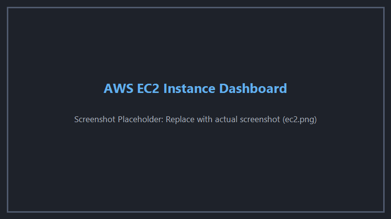
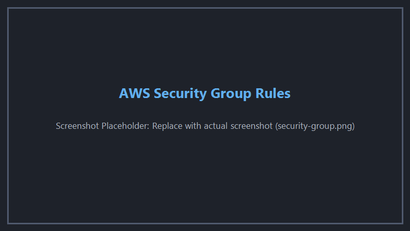
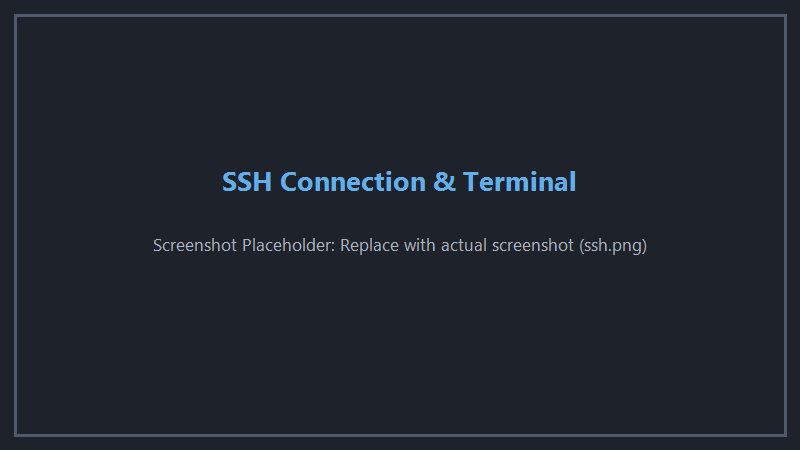
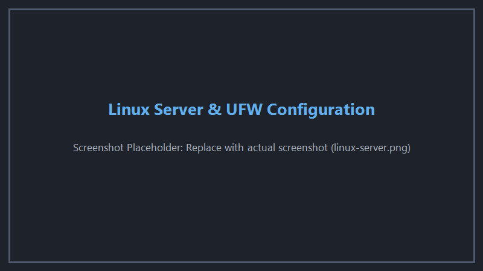
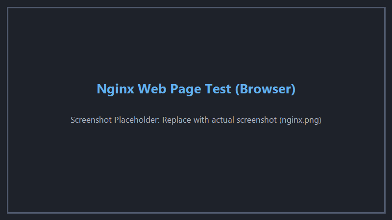

# Hands-On Cloud Deployment: Hardened Amazon Linux 2023 Server on AWS EC2

A complete, production-grade deployment walkthrough detailing Amazon Linux 2023 (AL2023) EC2 provisioning, network security group rules (Ports 22 & 80), SSH authentication via `ec2-user`, system updates via `dnf`, Apache (`httpd`) web server deployment, host security, and automated verification.

---

## 📋 Architecture & Deployment Overview

```
                                      INTERNET
                                         │
                                         ▼
            ┌────────────────────────────────────────────────────────┐
            │                 AWS Security Group                     │
            │              (Edge Perimeter Firewall)                 │
            │                                                        │
            │   • Inbound Port 22 (SSH)  ──> Restricted to My IP     │
            │   • Inbound Port 80 (HTTP) ──> Open to 0.0.0.0/0       │
            │   • Outbound Traffic       ──> Allowed (All Protocols) │
            └────────────────────────────┬───────────────────────────┘
                                         │
                                         ▼
            ┌────────────────────────────────────────────────────────┐
            │            AWS EC2 Virtual Machine (t3.micro)          │
            │                Amazon Linux 2023 (AL2023)              │
            │                                                        │
            │  ┌──────────────────────────────────────────────────┐  │
            │  │          Host Firewall (firewalld / iptables)    │  │
            │  │                                                  │  │
            │  │   • Port 22/tcp (SSH)     ──> ALLOW              │  │
            │  │   • Port 80/tcp (HTTP)    ──> ALLOW              │  │
            │  │   • Default Inbound       ──> DROP / REJECT      │  │
            │  │   • Default Outbound      ──> ALLOW              │  │
            │  └──────────────────────────┬───────────────────────┘  │
            │                             │                          │
            │                             ▼                          │
            │  ┌──────────────────────────────────────────────────┐  │
            │  │           Apache HTTP Web Server (httpd)         │  │
            │  │             (systemd managed unit)               │  │
            │  │                                                  │  │
            │  │   • Process: httpd (root master + apache worker) │  │
            │  │   • Socket:  0.0.0.0:80 (LISTENING)              │  │
            │  │   • Document Root: /var/www/html/index.html      │  │
            │  └──────────────────────────────────────────────────┘  │
            └────────────────────────────────────────────────────────┘
```

---

## Step 1: Provisioning the AWS EC2 Instance (Amazon Linux 2023)

1. Open the **AWS Management Console** $\rightarrow$ **EC2** $\rightarrow$ **Launch Instance**.
2. **Instance Name:** `amazon-linux-2023-server`.
3. **Application and OS Image (AMI):** Select **Amazon Linux 2023 AMI** (HVM, SSD Volume Type, 64-bit x86).
4. **Instance Type:** Select `t3.micro` (1 vCPU, 1 GiB Memory, AWS Free Tier eligible).
5. **Key Pair (Login):**
   - Choose or create your key pair: `testingserver.pem` (RSA or ED25519).
   - Download the private key and store it securely (e.g., in `~/.ssh/`).
6. **Network Settings:**
   - Auto-assign Public IP: **Enable**.
   - Firewall: Select **Create security group** (see Step 2).
7. Click **Launch Instance**.



---

## Step 2: Configuring AWS Security Group Rules

AWS Security Groups act as a stateful perimeter firewall at the hypervisor network interface:

### Inbound Rules Configuration

| Type | Protocol | Port Range | Source | Rationale |
|:---:|:---:|:---:|---|---|
| **SSH** | TCP | `22` | `My IP` (`x.x.x.x/32`) | Restricts administrative terminal access strictly to your current public IP. Never expose port 22 to `0.0.0.0/0`. |
| **HTTP** | TCP | `80` | `0.0.0.0/0` | Opens web traffic to the public Internet so users can view the Apache web server. |
| **HTTPS** | TCP | `443` | `0.0.0.0/0` | Reserved for future TLS/SSL encryption. |

### Outbound Rules Configuration

| Type | Protocol | Port Range | Destination | Rationale |
|:---:|:---:|:---:|---|---|
| **All traffic** | All | All | `0.0.0.0/0` | Enables `dnf` repository updates, outgoing DNS, and external API requests. |



---

## Step 3: Connecting via SSH as `ec2-user`

On Amazon Linux 2023, the default administrative user is **`ec2-user`** (not `ubuntu` or `root`).

### 1. Fix Private Key Permissions
OpenSSH refuses to use private keys that are world-readable:
```bash
# On Linux / macOS / Git Bash:
chmod 400 ~/.ssh/testingserver.pem

# On Windows PowerShell (if required):
# icacls.exe ~/.ssh/testingserver.pem /reset
# icacls.exe ~/.ssh/testingserver.pem /grant:r "$($env:USERNAME):(R)"
# icacls.exe ~/.ssh/testingserver.pem /inheritance:r
```

### 2. Connect to the Server
```bash
ssh -i "testingserver.pem" ec2-user@ec2-56-228-35-86.eu-north-1.compute.amazonaws.com
```

When prompted with `Are you sure you want to continue connecting (yes/no)?`, type **`yes`**.



---

## Step 4: Amazon Linux 2023 System Hardening & Configuration

### 1. Update OS Packages via `dnf`
Amazon Linux 2023 uses the **`dnf`** package manager (replacing legacy `yum` and Debian `apt`):
```bash
sudo dnf update -y
```

### 2. Create a Dedicated Non-Root User in the `wheel` Group
On Amazon Linux 2023, the administrative sudo group is named **`wheel`** (not `sudo`):
```bash
# Create deployuser with home directory and bash shell
sudo useradd -m -s /bin/bash deployuser

# Add deployuser to the wheel administrative group
sudo usermod -aG wheel deployuser
```

### 3. Provision SSH Access for `deployuser`
```bash
sudo mkdir -p /home/deployuser/.ssh
sudo cp ~/.ssh/authorized_keys /home/deployuser/.ssh/authorized_keys
sudo chown -R deployuser:deployuser /home/deployuser/.ssh
sudo chmod 700 /home/deployuser/.ssh
sudo chmod 600 /home/deployuser/.ssh/authorized_keys
```

### 4. Configure Host-Level Firewall (`firewalld`)
On Amazon Linux 2023, host-level firewalling is managed through `firewalld`:
```bash
# Install and enable firewalld
sudo dnf install firewalld -y
sudo systemctl enable firewalld --now

# Allow SSH (Port 22) and HTTP (Port 80) permanently
sudo firewall-cmd --permanent --add-service=ssh
sudo firewall-cmd --permanent --add-service=http

# Reload firewall rules
sudo firewall-cmd --reload

# Verify active firewall status
sudo firewall-cmd --list-all
```



---

## Step 5: Web Service Deployment (Apache `httpd`)

Install, configure, and verify the Apache HTTP Server (`httpd`).

### 1. Install and Start Apache `httpd`
```bash
# Install Apache httpd package
sudo dnf install httpd -y

# Enable and start the service immediately via systemd
sudo systemctl enable httpd --now

# Check service status
sudo systemctl status httpd --no-pager
```

### 2. Deploy a Custom HTML Page
In Apache on Amazon Linux 2023, the default web document root is `/var/www/html/`:
```bash
sudo tee /var/www/html/index.html > /dev/null <<'EOF'
<!DOCTYPE html>
<html lang="en">
<head>
    <meta charset="UTF-8">
    <meta name="viewport" content="width=device-width, initial-scale=1.0">
    <title>Amazon Linux 2023 — Apache Web Server</title>
    <style>
        body { font-family: -apple-system, BlinkMacSystemFont, "Segoe UI", Roboto, sans-serif; background: #0f172a; color: #f8fafc; display: flex; justify-content: center; align-items: center; min-height: 100vh; margin: 0; }
        .card { background: #1e293b; padding: 2.5rem; border-radius: 12px; box-shadow: 0 10px 25px rgba(0,0,0,0.5); max-width: 600px; width: 90%; border: 1px solid #334155; }
        h1 { color: #f59e0b; margin-top: 0; font-size: 1.8rem; }
        p { color: #94a3b8; line-height: 1.6; }
        .badge { display: inline-block; background: #d97706; color: white; padding: 4px 10px; border-radius: 6px; font-size: 0.85rem; font-weight: bold; margin-bottom: 1rem; }
        .details { background: #0f172a; padding: 1rem; border-radius: 8px; font-family: monospace; font-size: 0.9rem; margin-top: 1.5rem; border: 1px solid #334155; }
        .status-ok { color: #4ade80; font-weight: bold; }
    </style>
</head>
<body>
    <div class="card">
        <span class="badge">AMAZON LINUX 2023 EC2</span>
        <h1>Apache Web Server (httpd) Live</h1>
        <p>Successfully deployed Apache HTTP server on Amazon Linux 2023 with AWS Security Group port isolation (Port 22 restricted to My IP, Port 80 public).</p>
        <div class="details">
            <div>Service: <span class="status-ok">● httpd.service (Active)</span></div>
            <div>OS: Amazon Linux 2023 (AL2023)</div>
            <div>Listening Ports: 22 (SSH), 80 (HTTP)</div>
        </div>
    </div>
</body>
</html>
EOF

# Set ownership and permissions for Apache
sudo chown -R apache:apache /var/www/html
sudo chmod -R 755 /var/www/html
```

---

## Step 6: Automated Server Provisioning Script (AL2023)

Save this script as `server-setup.sh` to automate provisioning on any Amazon Linux 2023 EC2 instance:

```bash
#!/usr/bin/env bash
# server-setup.sh — Automated Amazon Linux 2023 Hardening & Apache httpd Deployment
# Usage: sudo bash server-setup.sh <NEW_USERNAME>

set -euo pipefail

NEW_USER="${1:-deployuser}"

echo "======================================================"
echo " Starting Amazon Linux 2023 Automated Setup"
echo " Target User: ${NEW_USER}"
echo "======================================================"

# 1. Update system packages using dnf
echo ">>> [1/6] Updating system packages via dnf..."
dnf update -y

# 2. Create non-root user and add to wheel group
echo ">>> [2/6] Provisioning user ${NEW_USER} in wheel group..."
if ! id -u "${NEW_USER}" >/dev/null 2>&1; then
    useradd -m -s /bin/bash "${NEW_USER}"
    usermod -aG wheel "${NEW_USER}"
    echo "${NEW_USER} ALL=(ALL) NOPASSWD:ALL" > "/etc/sudoers.d/${NEW_USER}"
    chmod 0440 "/etc/sudoers.d/${NEW_USER}"
fi

# 3. Setup SSH directory
echo ">>> [3/6] Setting up SSH keys for ${NEW_USER}..."
mkdir -p "/home/${NEW_USER}/.ssh"
if [ -f "/home/ec2-user/.ssh/authorized_keys" ]; then
    cp "/home/ec2-user/.ssh/authorized_keys" "/home/${NEW_USER}/.ssh/authorized_keys"
fi
chown -R "${NEW_USER}:${NEW_USER}" "/home/${NEW_USER}/.ssh"
chmod 700 "/home/${NEW_USER}/.ssh"
chmod 600 "/home/${NEW_USER}/.ssh/authorized_keys"

# 4. Install and configure firewalld
echo ">>> [4/6] Configuring host firewall (firewalld)..."
dnf install -y firewalld
systemctl enable firewalld --now
firewall-cmd --permanent --add-service=ssh
firewall-cmd --permanent --add-service=http
firewall-cmd --reload

# 5. Install and enable Apache httpd
echo ">>> [5/6] Installing and starting Apache (httpd)..."
dnf install -y httpd
systemctl enable httpd --now

# 6. Verify listening ports
echo ">>> [6/6] Verifying open listening sockets..."
ss -tulpn

echo "======================================================"
echo " Deployment Complete! Test with: curl http://localhost"
echo "======================================================"
```

---

## Step 7: Connectivity & Verification Tests

### 1. Local Server Verification
```bash
# Check listening sockets (confirms sshd on 22 and httpd on 80)
sudo ss -tulpn

# Local HTTP request
curl -I http://localhost
```
*Expected Output:*
```text
HTTP/1.1 200 OK
Date: ...
Server: Apache/2.4.58 (Amazon Linux)
Content-Type: text/html; charset=UTF-8
```

---

### 2. Remote Command-Line Verification (from Local Computer)
```bash
curl -I http://<YOUR_EC2_PUBLIC_IP>
```
*Expected Output:* Returns `HTTP/1.1 200 OK` from Apache on Amazon Linux.

---

### 3. Remote Browser Verification
Open your browser and navigate to:
```text
http://<YOUR_EC2_PUBLIC_IP>
```
*Expected Output:* The Apache web server page displays successfully!



---

### 4. Negative Firewall Verification
Confirm that unauthorized ports are dropped:
```bash
nc -zv -w 3 <YOUR_EC2_PUBLIC_IP> 8080
```
*Expected Output:* Times out or refused, confirming ports outside 22 and 80 are blocked by the AWS Security Group.
